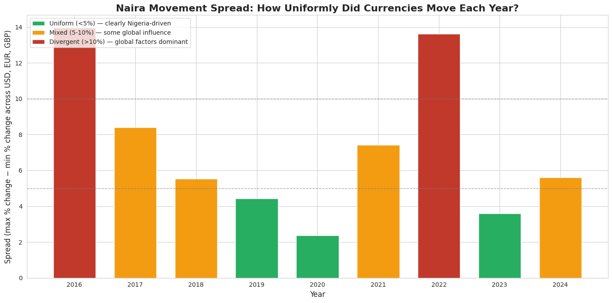
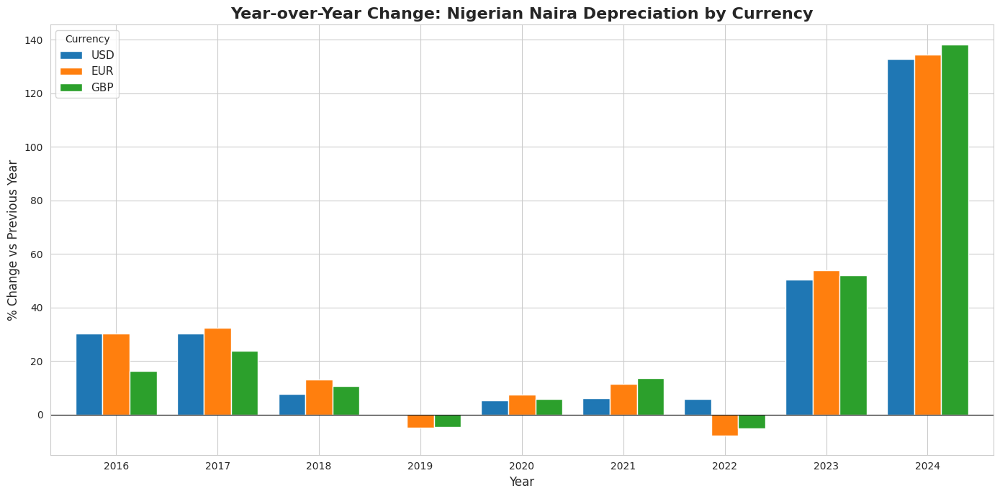

# Nigerian Naira Exchange Rate Analysis (2015-2024)

A 10-year data-driven look at how the naira has moved against USD, EUR, and GBP and a framework for distinguishing Nigeria-specific currency shocks from globally-influenced ones.

## The question

Everyone in Nigeria knows the naira collapsed in 2023-2024. That's not an insight, that's news. This project asked a sharper question: **when the naira moves, is it moving because of Nigeria, or because of the world around Nigeria?**

## The data

- **Source:** Yahoo Finance historical FX data
- **Period:** 2015-01-01 to 2024-12-31 (~2,600 daily observations)
- **Currencies:** USD/NGN, EUR/NGN, GBP/NGN
- **Access method:** `yfinance` Python library, pulled programmatically (not manually downloaded)

## Data quality journey

Real financial data isn't clean. Yahoo's historical NGN feed had 20+ suspicious data points:

- **9 impossible USD ticks** (e.g., USD/NGN = 1.00 on 2015-07-29, when the actual rate was ~₦196)
- **9 impossible GBP ticks** where GBP was trading *lower* than USD (mathematically impossible — GBP has been worth more than USD for the entire modern era)
- **Multiple missing values** (weekends, holidays, data feed gaps)

Cleaning approach:
1. **Numeric thresholds** to flag obvious bad ticks
2. **Cross-column relationship checks** (GBP must always exceed USD) to catch the subtler ones
3. **Day-over-day ratio checks** to catch single-day spikes that absolute thresholds missed
4. **Linear interpolation** to fill NaN values using surrounding daily data
5. **Iterative verification** — repeated `.describe()` and boundary checks after each cleaning pass

Cleaning was iterative: the first pass caught the obvious errors, but three more passes were needed to fully clean the dataset. Real data engineering is rarely one-and-done.

## The framework — Nigeria stories vs global stories

The core analytical insight: **if all three currencies (USD, EUR, GBP) move by the same percentage in a given year, the story is about Nigeria. If they diverge, external factors are pulling on the picture.**

I quantified this using a **spread metric**: `spread = max(% change) - min(% change)` across the three currencies for each year. A low spread means uniform movement (Nigeria-driven); a high spread means external factors are at play.

This lens turns out to correctly identify the years when global events (Brexit in 2016, USD dominance in 2022) were distorting what looked like naira-driven changes.

## Key findings

### 1. The 10-year picture

The naira has depreciated roughly **8-10x against all three major currencies** over the last decade. But that pattern is invisible on a linear scale, the 2024 numbers dwarf everything else. Log scale reveals the *shape* of the decline:

### 2. Year-over-year changes reveal two distinct crises

Grouped bar chart of yearly percentage changes shows the naira had two distinct shock periods (2023 and 2024) preceded by ~7 years of gradual, managed depreciation:

### 3. The crisis moments — June 2023 and February 2024

Zooming into monthly data across 2023-2024 revealed **two discrete crisis months**, not one:

- **June 2023:** USD jumped ~31% in one month. Timing matches the Tinubu administration's FX unification announcement on June 14, 2023.
- **February 2024:** USD jumped ~62% in one month — the single biggest monthly move in the entire dataset. Roughly **2x the June 2023 shock**.
- **April 2024** (often overlooked): the naira actually *strengthened* ~19% following aggressive CBN intervention, before resuming its decline the next month.

### 4. Nigeria stories vs global stories

Applying the spread framework across all 9 available years:

- **Clearly Nigeria-driven years (spread < 5%):** 2020, 2023 — the currency crises were domestic.
- **Mixed years (5-10%):** most of the middle of the decade.
- **Clearly globally-influenced years (spread > 10%):** 2016 (Brexit weakened GBP simultaneously with the naira's first devaluation) and 2022 (USD dominance globally masked naira weakness against EUR and GBP).

The lesson: **not every "naira moved" story is a Nigeria story.** In 2022, most reporting said "the naira strengthened against EUR/GBP." Actually, the naira was still weakening — the dollar was just surging faster globally.

## Structure of this repo

- [`ngn_fx_project_01_data_collection.ipynb`](./ngn_fx_project_01_data_collection.ipynb) — Fetching, initial cleaning, and iterative data quality checks
- [`ngn_fx_project_02_analysis.ipynb`](./ngn_fx_project_02_analysis.ipynb) — Yearly and monthly aggregation, spread computation, pattern discovery
- [`ngn_fx_project_03_visualization.ipynb`](./ngn_fx_project_03_visualization.ipynb) — Chart production

## Tools used

- **Python 3** — the language
- **pandas** — DataFrames, groupby, resampling, pct_change
- **yfinance** — programmatic access to historical FX data
- **matplotlib, seaborn** — visualization
- **Google Colab** — development environment
- **Google Drive** — persistent data storage across sessions

## Limitations and future work

- **Threshold choice.** The 5% and 10% spread thresholds are visually-motivated, not statistically derived. A more rigorous version would use standard deviation bands or a K-means classifier on spread values.
- **Sample size.** 9 years of yearly spread data is a small sample. Framework holds directionally but shouldn't be over-generalized.
- **Data source.** Yahoo Finance is a reasonable public source but not authoritative for NGN — CBN or Bloomberg data would be preferable for a production analysis.
- **Currency choice.** JPY/NGN data wasn't available. Adding CNY (yuan) would strengthen the analysis given Nigeria-China trade relations.

## About this project

Built as part of a public learning journey toward a Data Engineering role. Full journey documented on [LinkedIn](https://www.linkedin.com/in/ahmad-usman-b4484a180) and across other notebooks in [this repo](../).

---

*Feedback welcome. If you spot analytical mistakes or improvements, open an issue.*
